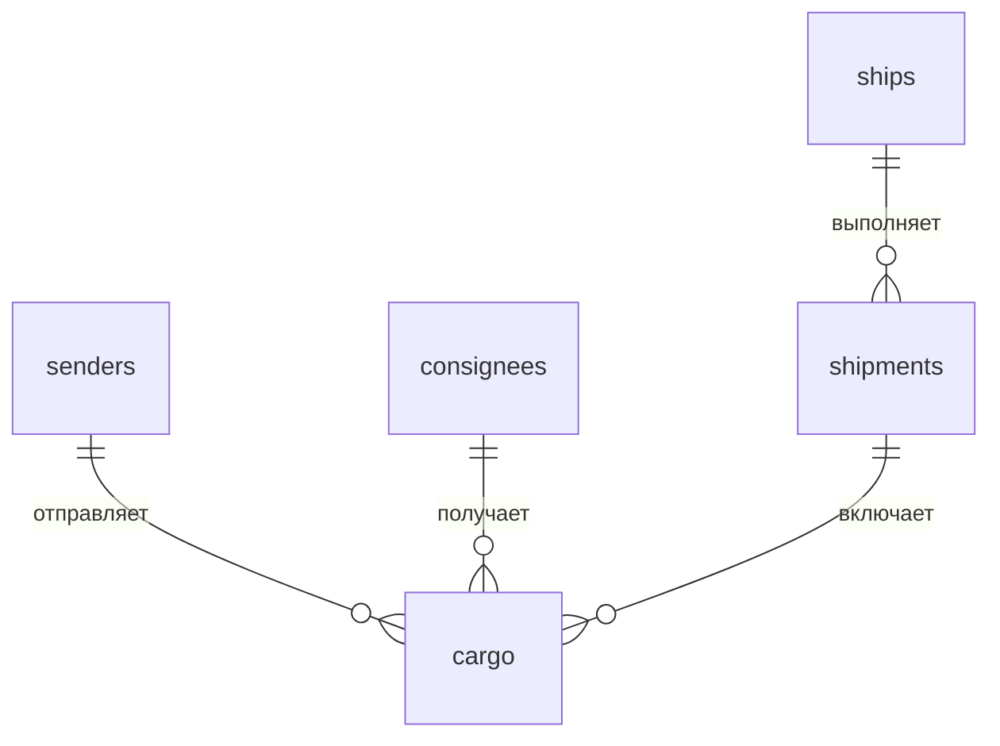
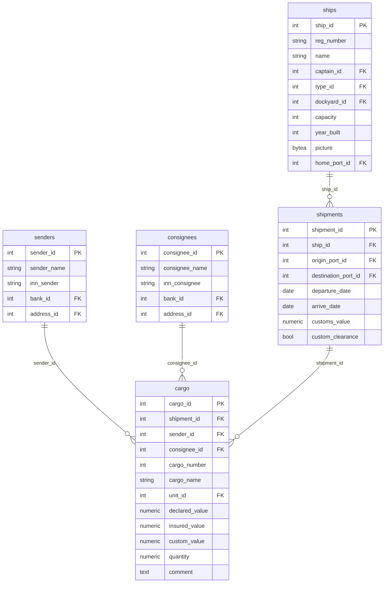
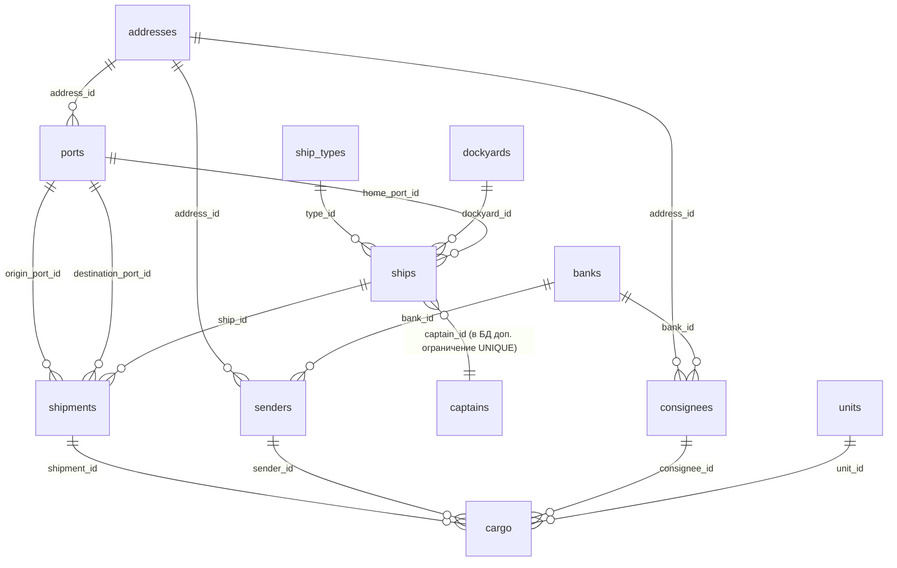

# ER-модель БД «Балтика» (нотация Чена и IDEF1X)

Соответствует скрипту `sql/deploy/02_schema.sql`.

**Отличие от упрощённой схемы «судно → груз»:** в проекте **груз** (`cargo`) относится к **рейсу** (`shipments`), а уже **рейс** — к **судну** (`ships`). Порты отправления/назначения и даты хранятся в **рейсе**, а не в строке груза.

### Рисунок для подраздела «2.2 Концептуальная модель» (одна картинка)

**Файл:** [`ER_conceptual_baltika.svg`](ER_conceptual_baltika.svg) — векторная схема для вставки в Word (Вставка → Рисунок → этот файл) или экспорта в PNG через браузер (открыть SVG → снимок экрана / печать в PDF).

**Тип диаграммы:** упрощённая **ER-диаграмма** (entity–relationship): прямоугольники сущностей, связи линиями, кардинальность **1:N** / **N:1** / **M:1**. Это **не** классическая нотация Чена (нет ромбов связей и овалов атрибутов) и **не** IDEF1X (нет категорий PK/FK на фигурах). При необходимости пересобрать SVG из скрипта: `python docs/render_ER_conceptual_svg.py`.

**Почему так лучше, чем «ромбы Чена» для этой главы:** на концептуальном уровне в курсовых чаще ожидают **понятную ER-схему с кардинальностями 1:N**, а не полный Чен с овалами по каждому атрибуту — атрибуты у вас уже перечислены словами в тексте. SVG повторяет ваш абзац про связи и при этом совпадает с реальной БД: **груз не висит на судне напрямую**; **порт** участвует трижды по смыслу (приписка судна, отправление и назначение рейса) — на рисунке это отдельно подписано.

**Соответствие таблицам:** цепочка `ships` → `shipments` → `cargo`; `senders`/`consignees` → `cargo`; `ports` ← `shipments` (два внешних ключа) и ← `ships` (порт приписки); `addresses` ← `ports`; справочники — отдельным блоком с пунктиром (FK N:1), как в `02_schema.sql`.

---

## 1. Нотация Чена (логический уровень)

В классической нотации Чена: **сущности** — прямоугольники, **связи** — ромбы, **атрибуты** — овалы. Ниже — эквивалент в виде диаграммы ER (Mermaid на GitHub / VS Code отображает её как связи с кардинальностями).

### 1.1. Ядро предметной области (фрагмент, как на учебном рисунке, но по вашей БД)

Смысл связей:

| Ромб (связь)   | Сторона 1 | Сторона M | Пояснение |
|----------------|-----------|-----------|-----------|
| **отправляет** | Отправитель (`senders`) | Груз (`cargo`) | У одного отправителя много грузов; у груза один отправитель. |
| **получает**   | Получатель (`consignees`) | Груз (`cargo`) | Аналогично. |
| **включает**   | Рейс (`shipments`) | Груз (`cargo`) | Рейс — партия; в ней много записей груза. |
| **выполняет**  | Судно (`ships`) | Рейс (`shipments`) | Одно судно совершает много рейсов. |



### 1.2. Атрибуты ядра (как ключевые поля таблиц)



### 1.3. Полная схема (все таблицы `02_schema.sql`)



> **Как нарисовать «чистый» Чен с ромбами и овалами:** экспортируйте эту структуру в [draw.io](https://app.diagrams.net/), Dia, ERwin или используйте шаблон «Chen ER» — блоки из раздела 1.2 переносятся в овалы у сущностей, связи подписываются как в таблице выше.

---

## 2. IDEF1X (категория/ключи)

В IDEF1X различают **независимые** сущности (идентификатор — собственный PK) и **зависимые** (часть ключа или смысловая зависимость от родителя). В PostgreSQL все таблицы имеют **суррогатный PK** (`SERIAL`), поэтому ниже — **логическая** классификация.

### 2.1. Независимые сущности (корневые)

| Сущность     | PK (логический) | Примечание |
|--------------|-------------------|------------|
| `addresses`  | `address_id`      | Адрес. |
| `banks`      | `bank_id`         | Банк. |
| `ship_types` | `type_id`         | Тип судна. |
| `dockyards`  | `dockyard_id`     | Верфь. |
| `units`      | `unit_id`         | Единица измерения. |
| `captains`   | `captain_id`      | Капитан. |

### 2.2. Зависимые / связующие

| Сущность   | PK   | FK (родители) |
|------------|------|----------------|
| `ports`    | `port_id` | → `addresses` (опционально) |
| `senders`  | `sender_id` | → `banks`, `addresses` |
| `consignees` | `consignee_id` | → `banks`, `addresses` |
| `ships`    | `ship_id` | → `ship_types`, `captains` (1:1), `dockyards`, `ports` (порт приписки) |
| `shipments`| `shipment_id` | → `ships`, `ports` (два раза: отправление, назначение) |
| `cargo`    | `cargo_id` | → `shipments`, `senders`, `consignees`, `units` |

### 2.3. Кардинальность связей (для IDEF1X и отчётов)

- `ships` — `shipments`: **1 : N** (одно судно, много рейсов).
- `shipments` — `cargo`: **1 : N** (один рейс, много строк груза).
- `senders` — `cargo`: **1 : N**; `consignees` — `cargo`: **1 : N**.

### 2.4. Диаграмма IDEF1X (рисунок)

Файл **[`IDEF1X_baltika.svg`](IDEF1X_baltika.svg)** — логическая модель в стиле **IDEF1X**:

- у каждой сущности разделение на зону **ключа** (PK) и зону **атрибутов** (в т.ч. внешние ключи FK выделены цветом);
- **прямые углы** — справочники с «своим» PK без FK из других таблиц на верхнем уровне; **скруглённые углы** — сущности, в описание которых входят FK (порты, клиенты, судно, рейс, груз);
- связи **ненидентифицирующие** (пунктир): при суррогатных `SERIAL` везде внешний ключ не входит в первичный ключ;
- сплошная линия выделена для цепочки **Судно → Рейс → Груз**.

Пересборка SVG после правок скрипта:

```bash
python docs/render_IDEF1X_baltika_svg.py
```

---

## 3. Экспорт в картинку

- **Готовые SVG:** [`ER_conceptual_baltika.svg`](ER_conceptual_baltika.svg) (концептуальная ER), [`IDEF1X_baltika.svg`](IDEF1X_baltika.svg) (IDEF1X) — вставка в Word или открытие в браузере.
- **Из VS Code:** расширение «Markdown Preview Mermaid Support» → экспорт PDF/печать для блоков Mermaid выше.
- **Онлайн:** [mermaid.live](https://mermaid.live) — вставьте блок из раздела 1.2 или 1.3 → PNG/SVG.
- **Pandoc / Quarto:** рендер Markdown с Mermaid в PDF для пояснительной записки.

Если нужен **строго** ромб Чена в одном файле без Mermaid — удобнее собрать схему в draw.io по таблицам раздела 2.
